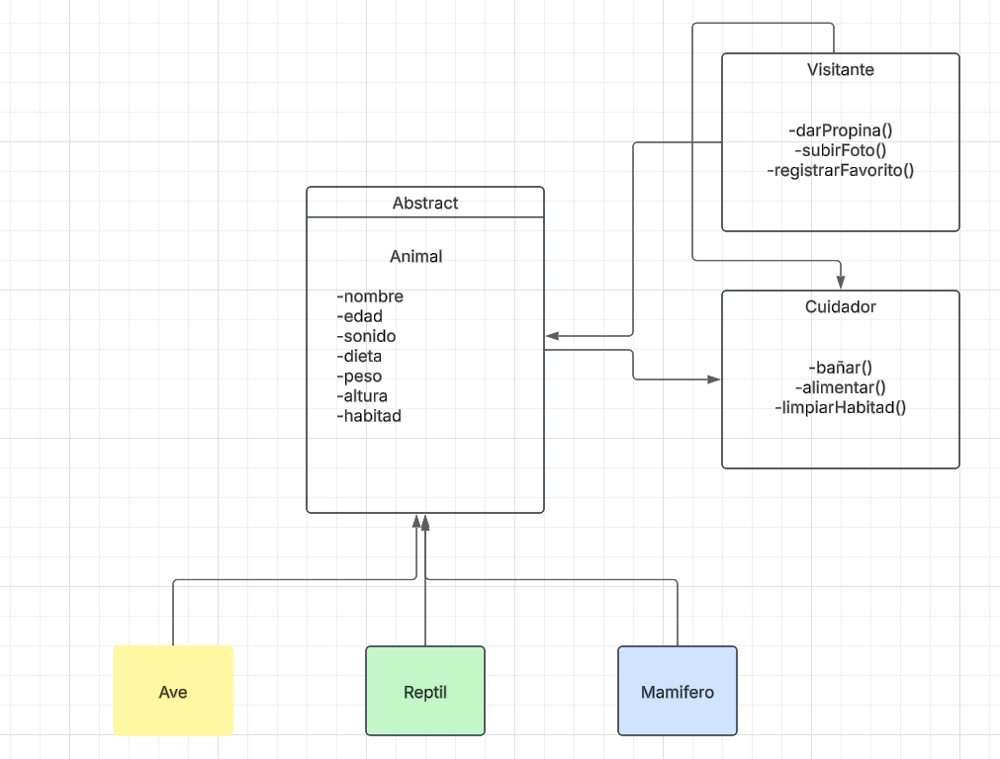
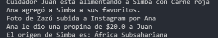

* Samuel Felipe Castelblanco Tellez
* Tomas Olaya Diaz

# 🐾 Reto #8: El Zoológico de los UML (ECI Zoo)
Este proyecto consiste en el diseño e implementación de un sistema de gestión para un zoológico, aplicando principios de programación orientada a objetos, **SOLID** y patrones de diseño.

---

## 📊 Diagrama de Clases UML

A continuación se presenta el diseño estructural de la solución:

---

## 🛠️ Patrón de Diseño Utilizado

### Patrón: Strategy (Estrategia) / Atributos Dinámicos
Para resolver el requisito de **atributos dinámicos** (color de pelaje, origen, rareza, historial médico) sin romper el código cada vez que se agregue una nueva especie, se implementó un enfoque de **Extensible Map**.

**¿Por qué se usó?**
1. **Flexibilidad:** No todos los animales tienen "color de pelaje" (ej. los reptiles tienen escamas). Crear un atributo para cada posibilidad en la clase base inflaría el objeto innecesariamente.
2. **Desacoplamiento:** Permite que el sistema crezca sin necesidad de recompilar o modificar las clases existentes cada vez que el zoológico reciba una especie exótica con atributos únicos.

---

## 🏗️ Aplicación de Principios SOLID

| Principio | Aplicación en el Proyecto |
| :--- | :--- |
| **S - Single Responsibility** | Cada clase tiene una responsabilidad única. `Animal` gestiona datos biológicos, `Cuidador` gestiona el mantenimiento y `Visitante` la experiencia de usuario. |
| **O - Open/Closed** | El sistema está **abierto a la extensión** (podemos añadir la clase `Pez` o nuevos atributos dinámicos) pero **cerrado a la modificación** (no necesitamos alterar `Animal.java` para que un león tenga "historial médico"). |
| **L - Liskov Substitution** | Las subclases `Mamifero`, `Reptil` y `Ave` pueden sustituir a la clase padre `Animal` en cualquier parte del código (ej. en la lista de animales del Cuidador) sin alterar el comportamiento del programa. |
| **I - Interface Segregation** | Se definen métodos de interacción específicos. El `Visitante` no tiene acceso a métodos de limpieza, solo a los de su competencia (alimentar, fotografiar). |
| **D - Dependency Inversion** | Las clases de alto nivel como `Cuidador` no dependen de clases concretas (como `Leon`), sino de la abstracción `Animal`. |

---

## 🚀 Tecnologías y Herramientas
* **Lenguaje:** Java 17+
* **Modelado:** UML 2.0
* **Documentación:** Markdown

---